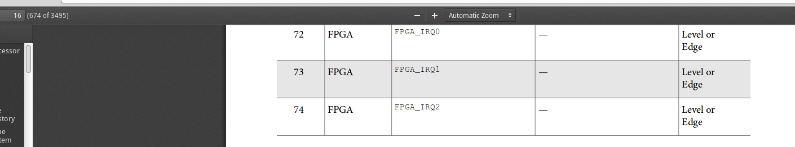

# Laboratoire 2 SOCF
Spinelli Isaia  
le 06 mars 2020

## Objectif

Ce laboratoire a pour but d’accéder à des I/O câblées sur la partie FPGA. Il s’agira d’ajouter des blocs PIO pour interfacer ces I/O sur le HPS. Je dois comprendre comment ajouter des IP disponibles dans Qsys pour  construire des  interfaces permettant d’accéder aux I/O de la FPGA depuis le HPS. Dans un deuxième temps, j'utiliserais les interruptions du HPS, qui seront générées par un PIO que j'utilise déjà. Je dois comprendre  le  mécanisme  des interruptions sur la Cyclone V SoC afin de bien gérer la gestion de celles-ci.

## 1er partie

La première partie consiste à utiliser que les LEDs et les switches. L'application demandée est de copier l'état des switches sur les LEDs.

Cette partie m'a surtout permis de pratique le work flow entièrement qui est bien décrit dans la donnée du laboratoire 1 ainsi que dans le document "TUTORIAL DES OUTILS DE CONCEPTION" fourni.

Cette partie permet aussi de découvrir les PIOs. On peut en apprendre plus en ouvrant la fenêtre d'un PIO et en cliquant sur "détail" en haut à droite.  Par exemple, on peux vite voir qu'on peut les configurer en entrée ou/et en sortie (on peut choisir une valeur par défaut). On peut aussi ajouter une interruption ainsi que choisir le type d'interruption (Level / Edge).

Pour accéder à la documentation officielle, il est possible de cliquer sur le lien "User Guide" indiqué dans les détails. 

De là, on apprend pourquoi il faut 16 adresses pour chaque PIO (de 0 à F). En effet, chaque PIO possède 4 registres de 32 bits :

- data					: lire ou écrire la valeur des données
- direction            : choisir la direction de chaque I/O
- interruptmask  : Activer/désactiver l'interruption pour chaque input
- edgecapture     : Détection du flanc de chaque input.

## 2ème partie

La deuxième partie consiste à réaliser la spécification décrit dans la donnée du laboratoire sans les interruptions.

Il a donc fallu ajouter les PIOs nécessaire pour gérer les afficheurs 7seg ainsi que les KEYs. J'ai décider de faire un PIO de 7 bits pour chaque 7 seg et non pas de faire un seul PIO pour les quatre 7seg.

Cette partie a été validé par M.Masle le vendredi 6 mars 2020.

## 3ème partie

La troisième partie consiste à réaliser le fonctionnement complet avec la prise en charge des interruptions.

Il a fallu activer les interruptions de la FPGA au HPS ainsi qu'activer les interruptions sur le PIO des KEYs.  
J'ai perdu beaucoup de temps afin de comprendre que ça ne fonctionnait pas car les interruptions étaient générées constamment. 

J'ai dû changer dans Qsys le fait que les interruptions doivent se générer sur flanc descendant et non pas sur le level.
J'ai décidé d'activer les interruptions sur le flanc descendant car les KEYs sont actives bas et je souhaitais gérer l'interruption dès l'appui du bouton et non pas le relâchement.

J'ai décidé de traiter les interruptions directement dans la routine car je pense que le traitement est relativement rapide. Il aurait été possible de changer l'état d'une variable et de faire le traitement dans le main lorsque cette variable est dans l'état attendue.

En ajoutant l'interruption dans le PIO des KEYs et le HPS (FPGA_to_HPS) à l'aide de Qsys, j'ai lié l'interruption sur la ligne irq0 jusqu'au HPS. J'ai donc du trouver le numéro d'interruption qui correspond à cette ligne. Voici l'information trouvée à la page 10-15 dans Cyclone V Hard Processor SystemTechnical Reference Manual :

Le numéro d'interruption est le 72.

Pour la partie du code, il a fallu désactiver/activer les interruptions via le registre cpsr, initialiser le mode IRQ, configurer le GIC et activer les interruptions des KEYs.
Je me suis inspiré de la doc fourni : "Using Linux on the DE1-SoC". A voir le code dans **/Projet/soft/src/**, le code est bien commenté.

Cette partie a été validé par M.Masle le vendredi 13 mars 2020.

## Conclusion

Ce laboratoire m'a permis de bien comprendre le work flow complet ainsi que l'utilité de chaque outil. Je pense que la prise en main du matériel ainsi que des logiciels sont maintenant bien claire. Ce fût particulièrement intéressant de traiter une interruption venant de la FPGA dans le HPS en passant par toutes les étapes.
